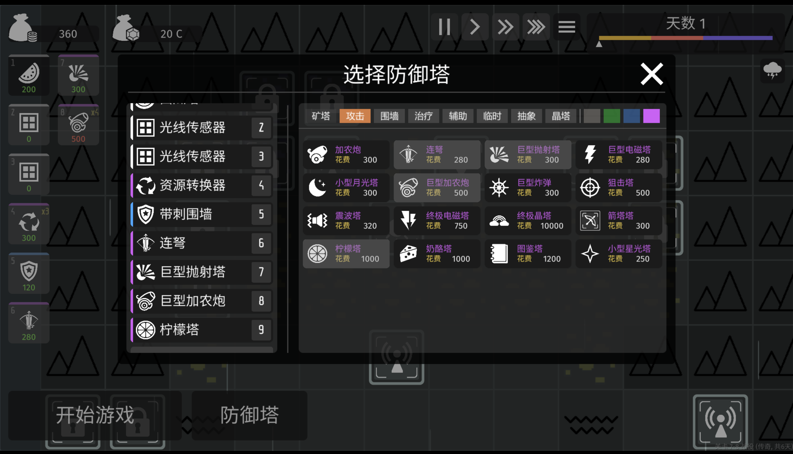

# Tower Filter Mod

---

## 中文介绍

Tower Filter Mod 是一个为《极简塔防（Minimalist Tower Defense）》制作的 UI 增强模组，在选塔界面中加入【分类筛选】与【等级筛选】功能，帮助玩家在后期或高难度游戏中更高效地选择防御塔。

本模组基于 **BepInEx** 与 **Harmony**，不修改任何游戏原始文件。

---

## English Description

Tower Filter Mod is a UI enhancement mod for *Minimalist Tower Defense*.  
It adds **category** and **rarity** filters to the tower selection panel, improving usability in late-game and high-difficulty runs.

Built with **BepInEx** and **Harmony**, without modifying any original game files.

---

## 功能 Features

- 分类筛选：攻击 / 矿塔 / 围墙 / 治疗 / 辅助 / 临时 / 抽象 / 晶塔  
- 等级筛选：灰 / 绿 / 蓝 / 紫  
- 原生风格 UI，非侵入式  
- 可随时切换筛选条件  

---

## 安装方法 Installation

### 1️⃣ 安装 BepInEx（必需）

本模组依赖 **BepInEx** 运行，请先安装。

- BepInEx 官方仓库  
  https://github.com/BepInEx/BepInEx

- Releases 下载页（推荐）  
  https://github.com/BepInEx/BepInEx/releases

通常请选择：
- **BepInEx 5.x**
- 对应平台的版本（Windows x64 / x86）

---

### 2️⃣ 安装 BepInEx 到游戏目录

1. 解压下载的 BepInEx 压缩包  
2. 将解压后的文件复制到《极简塔防》的游戏根目录  
3. 启动一次游戏  
4. 关闭游戏后，确认生成了以下目录：

BepInEx/plugins

---

### 3️⃣ 安装本模组

1. 前往本仓库的 **Releases** 页面  
2. 下载最新版本的 `TowerFilterMod.dll`  
3. 将 DLL 放入：

<游戏目录>/BepInEx/plugins/

4. 启动游戏即可生效

---

## 兼容性 Compatibility

- 不修改游戏文件，仅运行时注入  
- 理论上不影响存档  
- 可与大多数 BepInEx Mod 共存  

---

## 免责声明 Disclaimer

- 本项目不包含任何游戏原始资源或代码  
- 《极简塔防（Minimalist Tower Defense）》版权归原作者所有  
- 本模组仅用于学习、交流与 Mod 开发研究  

---

## License

MIT License
